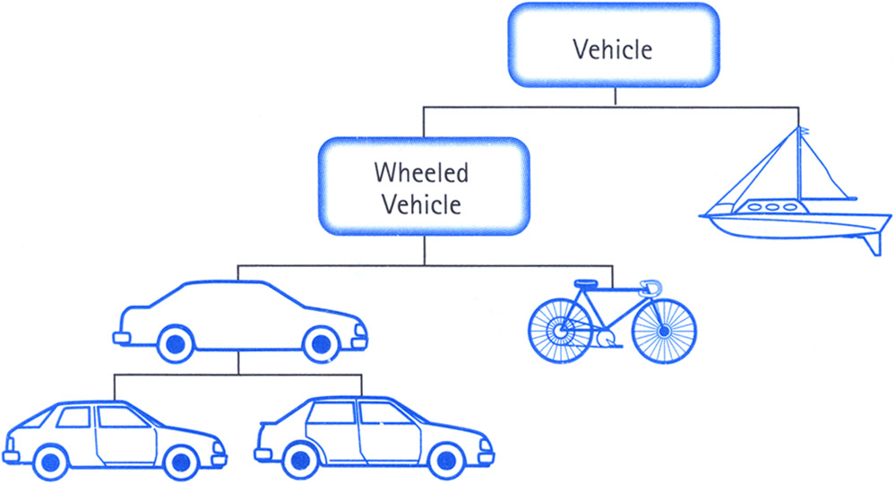
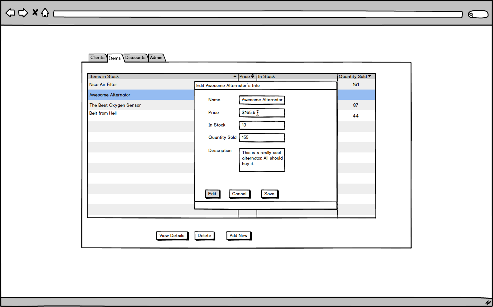
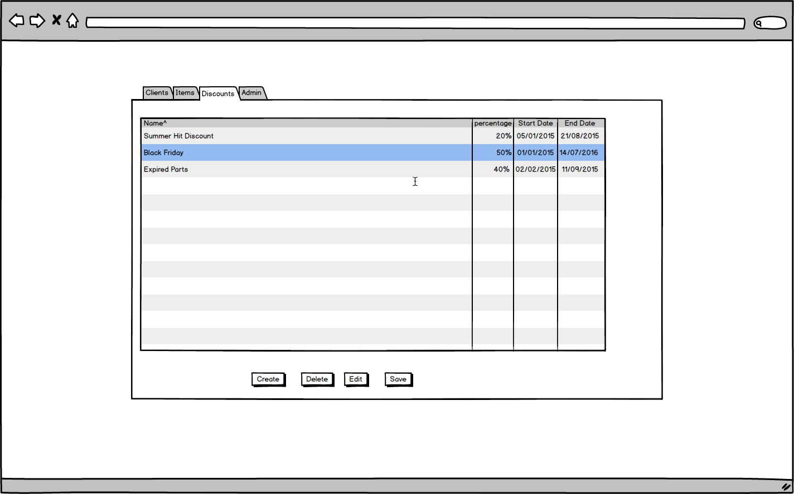
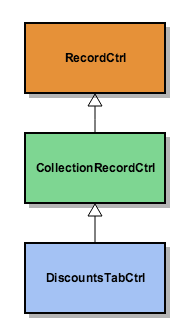

In this blogpost I am going to show you how easy it is to construct reusable abstractions with AngualarJS and ES6 Classes. If you are with a more Object Oriented Language Programming background this article might seem simple and trivial but if you are coming from a Javascript background like me you might get some benefit out of it since in Javascript OOP is a bit harder to comprehend and see.

# Class-based VS Prototype-based programming
As you know Javascript is a [prototype-based language](https://en.wikipedia.org/wiki/Prototype-based_programming) which differentiates a lot from traditional [Class-based programming](https://en.wikipedia.org/wiki/Class-based_programming). In prototype based programming we only have objects and those objects have their own prototypes from which they derive, as in class based programming we have common classes of objects which serve as a common abstraction for the objects we create.
Inheritance is just the derivation of one class from another so that the common behaviour can be kept.
Fortunately in ES6 we now have classes, so we can choose whatever way of object composition and inheritance we find suitable.
  


// es5 prototype based inheritance

function Vehicle(weight, speed) {
  this.weight = weight;
  this.speed = speed;
}

Vehicle.prototype.start = function () {
  console.log('brum brum... I\'m starting!!!');
}

// inheritance in prototype orinted manner

function Yacht(name, weight, speed, engine) {
  Vehicle.call(this, weight, speed);
  this.name = name;
  this.engine = engine;
}

// set the prototype of Yacht to be Vehicle (prototype-based inheritance)
Yacht.prototype = Object.create(Vehicle.prototype);

// construct our new yacht which is also a vehicle
var carolineYacht = new Yacht('Caroline', 38, 4, {type: 'diesel'});


As in more class oriented manner (ES6) we have:


// es6 class based inheritance

class Vehicle {
  constructor(weight, speed) {
    this.weight = weight;
  }
}

class Yacht extends Vehicle {
  constructor(name, weight, speed, engine) {
    super(weight, speed);
    this.name = name;
    this.engine = engine;
  }
}

// construct our new yacht which is also a vehicle
let carolineYacht = new Yacht('Caroline', 38, 4, {type: 'diesel'});


The two aproaches look very similiar but in the same time it's a lot easier to spot inheritance and Object Oriented Principles in class oriented style of programming. So far so good, but how can we take advantage of inheritance in a real life example?

# Automobile Parts Shop
Often when we are dealing with single page applications we find ourselves repeating a lot of the logic and code. That's also the case with content management applications. Imagine we have a user interface with multiple buttons for record editting modals. Let's start with a automobile parts shop.
  

  

As you can see in the mockup we have a window for editting automobile part information. But we might also have windows for editting client information, discounts, all kind of different commerce oriented data. In using AngularJS with Javascript we can use the angular.ui $modal service for openning new modals and for each modal we attach a controller function which deals with the DOM logic. But we have so many similiar controllers to attach, we have an edit client controller, edit item, edit discount, and we might have more and more as our application grows. Wouldn't it be great if we can attach one controllers for all our modals which contains all the DOM logic. In the same time we can't use only one controller for all the modals since we have different API communication, we might have different UI behavior, we might have so many different details for every modal. Also we would like our logic to be decoupled from the angularJS specifics. Even though we can't use a single controller for every modal, we can pull the similiarities into a single reusable base class using Inheritance.


class RecordCtrl {

  constructor(record, Storage) {
    this.record = this.original = record;
    this.Storage = Storage;
    this.editable = false;
  }

  // makes a copy of the editted record
  preserve() {
    this.original = Object.assign({}, this.record);
  }

  // Resets the editted record to the preserved one.
  reset() {
    if (this.original) {
      this.record = this.record && this.original;
    }
  }

  toggleEditOn() {
    this.editable = true;
  }

  toggleEditOff() {
    this.editable = false;
  }

  isEditable() {
    return this.editable;
  }

  // Saves the record and toggles edit mode off
  save() {
    return this.Storage.save(this.record)
      .then(() => this.toggleEditOff());
  }

  // enters edit mode and saves a clone of the record being editted
  edit() {
    this.preserve();
    this.toggleEditOn();
  }

  // cancels editting of a record and resets back to before the edit start
  cancel() {
    this.reset();
    this.toggleEditOff();
  }
}


If we investigate the code we can see that we are just creating a simple class RecordCtrl which esentially has two primary fields: record to be editted or saved, and a Storage related to that record. The Storage is just a DataMapper which has all the required Network Communication operations like **CREATE**, **READ**, **UPDATE** and **DELETE**. You can read more about the Data Mapper in my previous blogpost: [Using Data Mapper with AngularJS and Typescript](https://nshahpazov.github.io/using-data-mapper-in-angularjs-with-typescript) or [here](http://martinfowler.com/eaaCatalog/dataMapper.html).

 
We can use the RecordCtrl class by extending it in a concrete **AutoPartModalCtrl** class.

class AutoPartModalCtrl extends RecordCtrl {

  constructor($scope, $modalInstance, selectedAutoPart, AutoPartStorage) {
    super(selectedAutoPart, AutoPartStorage);

    this.$modalInstance = $modalInstance;
  }

  // specific logic for the modal
  // ...
  close(edittedRecord) {
    this.$modalInstance.close(edittedRecord);
  }
}


And we just use the class as a Controller function passed to the $modal opener.

const AUTO_PART_MODAL_TEMPLATE = 'views/auto-parts/auto-part-modal-tpl.html';
class ItemsTabCtrl {
  constructor($modal) {
    this.$modal = $modal;
  }

  openDetails(selected) {
    this.$modal.open({
      controller: 'AutoPartModalCtrl',
      controller: 'partsModal',
      templateUrl: AUTO_PART_MODAL_TEMPLATE,
      resolve: {
        selectedAutoPart: () => selected,
        AutoPartStorage: (AutoPartStorage) => AutoPartStorage
      }
    });
  }
}



But why stop here? What if we have page with a grid which has the rest of the CRUD operations.
Something like this:
  

  
So now we can edit, but we can also add new records and delete old ones. We have the old edit and save functionality but we also want to add new ones, like create and delete.
Why don't we just inherit the RecordCtrl class by a new class which can later also inherit?


// the Collection Record Controller extending the Record Controller

class CollectionRecordCtrl extends RecordCtrl {
  constructor($scope, records, Storage) {
      super(records[0], Storage);
      this.records = records;
      this.selected = [records[0]];

      // we update the record everytime the selected is changed
      $scope.$watch('vm.selected[0]', val => this.record = val);
  }

  // sets the grid options method using default ones
  setGridOptions(gridOptions) {
    this.gridOptions = Object.assign({
      data: 'vm.records',
      multiSelect: false,
      selectedItems: this.selected,
      beforeSelectionChange: () => !this.editable
    }, gridOptions);
  }

  _addVisually(record) {
    this.records.push(record);
    this.gridOptions.selectAll(false);
    this.selected[0] = record;
    this.gridOptions.selectItem(record);
  }

  // adds new record to the grid visually and sets edit on
  add() {
    this.record = {isNew: true};
    this._addVisually(this.record);
    return this.toggleEditOn();
  }

   // deletes an element from the grid visually
  _deleteVisually() {
    this.records.splice(this.records.indexOf(this.record), 1);
    this.gridOptions.selectAll(false);
  }

  // deletes an element using the storage delete operations and then visually
  delete(record, id) {
    return this.Storage.delete(id).then(() => this._deleteVisually());
  }

  // if it's a new record it persists it, if not it just uses the super.save function
  save() {
    if (this.record.isNew) {
      return this.Storage.create(this.record)
        .then(record => this.record = record)
        .then(() => this.toggleEditOff());
    }
    this.record.isNew = false;
    return super.save();
  }

  // cancels and removes visually if it's just added to the grid
  cancel() {
    super.cancel();
    if (this.record.isNew) {
      this._deleteVisually();
      this.selected[0] = undefined;
    }
  }
}


And again we just extend the CollectionRecordCtrl the same way as before.


// discounts tab controller

class DiscountsTabCtrl extends CollectionRecordCtrl {
  constructor($scope, discounts, DiscountStorage) {
    super($scope, discounts, DiscountStorage);
  }

  // specific logic for the discounts tab controller
  // ...
}


# The moral of the story
Now that we have finished creating our base abstractions, we can just extend them wherever we have similiar functionality instead of just writing new controllers every time.
This is indeed very powerful and useful when dealing with enterprise applications where the focus is on data management (creating, deleting and editing different data records). I hope you've enjoyed this article and it has come in handy to you.